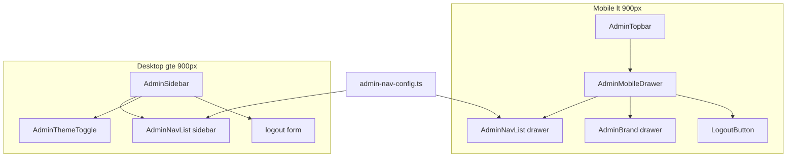

# Admin Mobile Header & Drawer Audit — MH1

## Objetivo

Auditar de punta a punta el **header global mobile de `/admin`** y su **drawer/sidebar mobile**, identificando qué preservar, qué mejorar, qué quitar, gaps frente al sidebar desktop, tokenización, a11y y deuda CSS — **sin implementar fixes**.

## Contexto

- **S1 / S1.1:** sidebar desktop enterprise polish (theme toggle, collapsed rail). Ver `docs/admin-sidebar-enterprise-polish-s1-1.md`.
- **Board handoff:** `AdminShell` + sidebar rail desktop + topbar mobile documentados en `docs/board-orders-execution-area-v1-final-handoff.md`.
- **Products handoff:** shell/header alignment en P2A — `docs/admin-products-v1-visual-handoff.md`.
- **Observación visual reportada (capturas):** topbar oscuro + hamburger; drawer panel **claro** desconectado del admin dark; brand con bajo contraste; nav sin iconos; posible ítem vacío; footer email + logout crudo; sin theme toggle en mobile.

**Referencias ausentes:** ninguna bloqueante. `docs/admin-layout-system-v1.md` existe pero referencia `AdminHeader.tsx` (nombre legacy); implementación real usa `AdminTopbar`.

## Capturas revisadas

Auditoría basada en descripción de capturas provistas en el prompt MH1 (no re-ejecutada en browser en esta sesión):

| Captura | Observación documentada |
|---------|-------------------------|
| `/admin/dashboard` mobile cerrado | Topbar con superficie tokenizada oscura; logo + hamburger claro/blanco |
| Drawer abierto | Panel cream/blanco; close circular; brand header; links Productos/Equipo/Configuración; email + logout abajo |

**Nota:** Si en captura falta **Pedidos**, verificar rol/permisos (`viewOrders`) — no asumir bug sin confirmar rol del operador.

## Archivos revisados

| Archivo | Rol |
|---------|-----|
| `app/admin/(protected)/layout.tsx` | Layout protegido; import CSS shell/header/drawer |
| `components/admin/admin-shell.tsx` | Grid shell: sidebar rail + column (topbar + main) |
| `components/admin/admin-shell.css` | Breakpoints 900px desktop / mobile topbar |
| `components/admin/admin-topbar.tsx` | Header mobile: brand + `AdminMobileDrawer` |
| `components/admin/admin-header.css` | Inner layout topbar; **legacy** `.admin-nav-link` |
| `components/admin/admin-mobile-drawer.tsx` | Drawer state, portal, Escape, scroll lock class |
| `components/admin/admin-mobile-drawer.css` | Estilos drawer/hamburger — **hardcoded light** |
| `components/admin/layout/admin-sidebar.tsx` | Sidebar desktop: nav + account + theme + logout |
| `components/admin/layout/admin-sidebar.module.css` | Sidebar tokenizado; collapsed rail ≥900px |
| `components/admin/layout/admin-nav-list.tsx` | Nav compartido sidebar/drawer; iconos sólo sidebar |
| `components/admin/layout/admin-brand.tsx` | Brand sidebar vs drawer variants |
| `components/admin/layout/admin-brand.module.css` | Brand drawer tokenizado |
| `components/admin/layout/admin-theme-toggle.tsx` | Theme toggle — **sólo sidebar desktop** |
| `components/admin/admin-nav-config.ts` | Fuente única de nav items + permisos + feature flags |
| `components/admin/logout-button.tsx` | Logout mobile drawer (`admin-secondary-link`) |
| `app/globals.css` | `html/body.admin-drawer-open` scroll lock |
| `components/admin/admin-surfaces.css` | `admin-secondary-link` tokens |
| `docs/admin-sidebar-enterprise-polish-s1-1.md` | Contexto sidebar desktop |
| `docs/admin-layout-system-v1.md` | Layout system (parcialmente desactualizado) |

**No existe:** `admin-topbar.css` separado; `admin-nav-links.tsx` (eliminado según living memory).

## Arquitectura actual

```
app/admin/(protected)/layout.tsx
  └─ AdminShell (client)
       ├─ admin-shell__sidebar-rail (hidden <900px)
       │    └─ AdminSidebar
       │         ├─ AdminBrand variant="sidebar"
       │         ├─ AdminNavList variant="sidebar"
       │         └─ accountBlock: avatar, AdminThemeToggle, logout form
       └─ admin-shell__column
            ├─ AdminTopbar (visible <900px)
            │    ├─ AdminBrand variant="sidebar"  ← reutiliza CSS collapsed sidebar
            │    └─ AdminMobileDrawer
            │         ├─ hamburger button
            │         └─ portal: overlay + aside[role=dialog]
            │              ├─ AdminBrand variant="drawer"
            │              ├─ AdminNavList variant="drawer"
            │              └─ footer: userLabel + LogoutButton
            └─ main → children + AdminFooter
```

### Respuestas arquitectura (§5.1)

| Pregunta | Respuesta |
|----------|-----------|
| ¿Dónde vive mobile topbar? | `AdminTopbar` en `admin-topbar.tsx`, renderizado en `AdminShell` columna; visible `<900px` (`admin-shell.css`). |
| ¿Dónde vive drawer? | `AdminMobileDrawer` — portal a `document.body` cuando `isOpen`. |
| ¿Comparte componente con desktop sidebar? | **Parcial:** nav compartido (`AdminNavList`, `admin-nav-config`); shell **duplicado** (sidebar vs drawer portal). |
| ¿Nav items fuente común? | **Sí:** `getAdminNavItemsForRole` + `isAdminNavItemFeatureEnabled`. |
| ¿Active route compartida? | **Sí:** `isAdminNavItemActive(pathname, item)` en `AdminNavList`. |
| ¿Logout/theme duplicados? | **Sí:** theme sólo sidebar; logout sidebar form vs `LogoutButton` en drawer. |
| ¿Diferencias intencionales? | Breakpoint 900px; drawer light legacy vs sidebar tokenizado — **probablemente no intencional** post-dark admin. |

## Mapa de componentes



## Data flow / nav items

```ts
// admin-nav-config.ts — orden fijo
Pedidos      → /admin/dashboard     (viewOrders)
Cocina       → /admin/kitchen       (viewOrders + kitchen_mode_active)
Productos    → /admin/products      (manageProducts)
Equipo       → /admin/team          (manageTeam)
Configuracion→ /admin/settings/public (manageNotifications)
```

Filtrado idéntico en `AdminSidebar` y `AdminMobileDrawer` vía `useAdminBusinessSettings()`.

**Durante `loading`:** items con `requiredFeatureFlag` (Cocina) **no renderizan** — puede causar “salto” al cargar settings, no un ítem vacío.

## Mobile topbar audit

| Aspecto | Estado | Clasificación |
|---------|--------|---------------|
| Superficie header | Tokens `--surface-elevated-bg`, border, shadow (`admin-shell.css`) | TOKENIZED |
| Brand block | `AdminBrand variant="sidebar"` | **BUG / VISUAL GAP** |
| Hamburger | `admin-mobile-drawer.css` — fondo `#fff`, border `#ddd2c5` | HARDCODED / legacy light chip |
| Título “Panel operacional” en topbar | Oculto: `.brandText { opacity: 0 }` sin `.sidebar:hover` | **BUG** — texto invisible fuera del sidebar |
| `admin-topbar__brand` hidden ≥900px | Correcto cuando topbar oculto | INTENTIONAL |

**VISUAL_FINDING:** En mobile topbar, el operador ve **solo logo/icono**, no nombre del negocio ni kicker — porque se reutilizan estilos del rail colapsado desktop.

## Mobile drawer audit

| Aspecto | Estado | Clasificación |
|---------|--------|---------------|
| Panel background | `#fffdf9`, gradientes blancos, borders `#ded4c9` | **HARDCODED** — no respeta `data-dashboard-theme` |
| Contraste en dark admin | Drawer permanece light mientras canvas es dark | **VISUAL GAP** |
| Nav links | Text-only, sin iconos Lucide | **VISUAL GAP** vs desktop |
| Active state | `--active` invierte a `#1f1a14` / `#fff` hardcoded | HARDCODED |
| Brand header | `AdminBrand variant="drawer"` — tokens en `admin-brand.module.css` | PARTIALLY TOKENIZED dentro de panel light |
| Close button | 44×44px, circular blanco | OK touch; hardcoded colors |
| Footer | `<p>{userLabel}</p>` + `LogoutButton` | FUNCTIONAL; crude vs sidebar account block |
| Theme toggle | **Ausente** | **FUNCTIONAL GAP** |
| Avatar | **Ausente** | VISUAL GAP |
| z-index | portal `60`, sidebar desktop `40` | OK layering |

**VISUAL_FINDING:** Drawer se siente **legacy / pre-S1**, no alineado al polish enterprise del sidebar desktop.

**VISUAL_FINDING “ítem vacío”:** No hay slot vacío en código. Hipótesis: (1) **Pedidos** omitido por permisos en captura; (2) usuario interpreta **logo-only topbar** como fila vacía; (3) flash mientras settings carga oculta Cocina. Verificar en QA con rol owner/admin.

## Desktop sidebar parity

| Dimensión | Desktop | Mobile drawer | Clasificación |
|-----------|---------|---------------|---------------|
| Fuente nav | `admin-nav-config` | Igual | INTENTIONAL |
| Iconos nav | Lucide por ruta | Ninguno | VISUAL GAP |
| Active indicator | Rail + subtle bg | Pill invertida hardcoded | VISUAL GAP |
| Brand kicker | “Panel operacional” | Igual en drawer variant | OK en drawer; roto en topbar |
| Theme | `AdminThemeToggle` | No | **FUNCTIONAL GAP** |
| Logout | Icon + label en sidebar styles | `admin-secondary-link` | VISUAL GAP |
| Account | Avatar initial + email | Email plain `<p>` | VISUAL GAP |
| Collapsed rail | 72px hover expand | N/A | INTENTIONAL |
| Permisos / feature flags | Sí | Sí | INTENTIONAL |

## Functional parity matrix

| Feature | Desktop sidebar | Mobile drawer | Estado | Acción recomendada |
|---------|-----------------|---------------|--------|--------------------|
| Pedidos nav | sí | sí* | OK* | *si `viewOrders` |
| Cocina nav | condicional | condicional | OK | — |
| Productos nav | condicional | condicional | OK | — |
| Equipo nav | condicional | condicional | OK | — |
| Configuración nav | condicional | condicional | OK | — |
| Theme toggle | sí | **no** | **FUNCTIONAL GAP** | MH2: agregar `AdminThemeToggle` al drawer footer |
| Logout | sí | sí | OK | MH3: unificar estilo con sidebar |
| Account email | sí (+ avatar) | sí (solo texto) | PARTIAL | MH3: avatar + layout account block |
| Active route | sí (`aria-current`) | sí | OK | MH3: alinear estilo active con tokens |
| Icons | sí | **no** | **VISUAL GAP** | MH3: reutilizar `SIDEBAR_NAV_ICONS` en drawer |
| Role filtering | sí | sí | OK | — |
| Feature flags | sí | sí | OK | — |
| Focus trap | n/a | **no** | **FUNCTIONAL GAP** | MH2: focus trap + return focus |
| Escape close | n/a | sí | OK | — |
| Overlay close | n/a | sí | OK | — |
| Body scroll lock | n/a | sí (`admin-drawer-open`) | OK | — |
| Route change close | n/a | sí | OK | — |

## Visual QA findings

| ID | Finding | Tipo |
|----|---------|------|
| VF-1 | Drawer panel cream/blanco vs admin dark canvas | VISUAL_FINDING |
| VF-2 | Hamburger button white chip desconectado del topbar dark | VISUAL_FINDING |
| VF-3 | Topbar brand text invisible (sidebar CSS misuse) | VISUAL_FINDING |
| VF-4 | Drawer nav sin iconos — jerarquía menos enterprise | VISUAL_FINDING |
| VF-5 | Active link hardcoded black/white vs sidebar subtle rail | VISUAL_FINDING |
| VF-6 | Footer account section plano (email + link) vs sidebar polish | VISUAL_FINDING |
| VF-7 | Sin theme toggle en mobile — operador no puede cambiar tema sin desktop | VISUAL_FINDING |
| VF-8 | Drawer brand tokens OK pero panel light anula contraste dark mode | VISUAL_FINDING |

**Preguntas capturas (§6):**

| Pregunta | Auditoría |
|----------|-----------|
| ¿Drawer dark o light? | Hoy **light hardcoded**. Recomendación MH3: **dark-aligned** con tokens admin O light premium tokenizado — decisión producto. |
| ¿Topbar solo logo o + título? | Debería mostrar identidad; bug actual oculta texto. |
| ¿Hamburger consistente con iconografía sidebar? | No — líneas custom vs Lucide en nav desktop. |
| ¿Incluir Dashboard/Pedidos? | **Pedidos** ya es el label del dashboard en config; no duplicar ruta. |
| ¿Paridad desktop? | Funcional nav sí; theme/account/visual no. |
| ¿Theme en drawer? | **Debería** (MH2). |
| ¿Rol/sesión? | Email sí; rol no; sesión operativa no en drawer. |

## Accessibility audit

| Criterio | Estado | Notas |
|----------|--------|-------|
| Hamburger `aria-label` | ✓ “Abrir navegacion” | |
| `aria-expanded` / `aria-controls` | ✓ | |
| Close `aria-label` | ✓ “Cerrar navegacion” (overlay y X) | Duplicado label OK |
| `role="dialog"` + `aria-modal="true"` | ✓ | |
| `aria-current="page"` | ✓ en links activos | |
| Focus trap | ✗ | Tab puede salir del drawer — **P1 a11y** |
| Focus return al cerrar | ✗ | No implementado |
| Escape | ✓ | |
| Overlay click | ✓ | |
| Body scroll lock | ✓ | `overflow:hidden` + `touch-action:none` en body |
| Touch targets | ✓ ≥44px hamburger/close; 48px links | |
| Contrast drawer light on dark backdrop | Parcial | Panel light OK internamente; desconexión temática no es fallo WCAG per se |
| `prefers-reduced-motion` | ✗ | Transitions sin media query reduce | P3 |
| Logout submit | ✓ button nativo | |

## Tokenization audit

| Área | Clasificación | Detalle |
|------|---------------|---------|
| `admin-shell.css` header/main | TOKENIZED | `--surface-*`, `--bg-canvas` |
| `admin-sidebar.module.css` | TOKENIZED | `--bg-surface`, `--text-*`, `--border-subtle` |
| `admin-brand.module.css` (drawer) | PARTIALLY TOKENIZED | Tokens texto; panel padre light hardcoded |
| `admin-mobile-drawer.css` | **HARDCODED** | ~20+ hex/rgba; no usa `--bg-*` admin |
| `admin-header.css` `.admin-nav-link` | LEGACY / unused? | No referenciado en TSX actual |
| z-index drawer `60` | HARDCODED | Documentar escala |
| Focus outline `#1f1a14` | HARDCODED | drawer CSS |

## CSS legacy audit

| Item | Clasificación | Evidencia |
|------|---------------|-----------|
| `.admin-nav-link` en `admin-header.css` | **LEGACY** | Sin consumidores TSX; reemplazado por sidebar/drawer |
| `admin-nav-links.tsx` | **Removed** | Living memory; 0 files |
| Drawer CSS duplicado vs public business drawer tokens en `globals.css` | **LEGACY pattern** | Business drawer tokenizado; admin drawer no |
| `admin-topbar__brand { display:none }` @900px | OK | Coherente con topbar hidden |
| Media query 768px en drawer reduce blur | PARTIAL | Inconsistente con 900px shell breakpoint |
| `:global` en drawer CSS | None | — |
| Sidebar `.brandText opacity:0` sin context sidebar | **BUG risk** | Afecta topbar mobile |

## Issues encontrados

| ID | Prioridad | Área | Issue | Evidencia | Recomendación |
|----|-----------|------|-------|-----------|---------------|
| MH1-01 | P2 | Topbar brand | Texto brand/kicker invisible en mobile topbar | `AdminBrand variant="sidebar"` + `.brandText { opacity:0 }` fuera de `.sidebar` | MH2: variant `topbar` o forzar visible en topbar context |
| MH1-02 | P2 | Theme | Theme toggle ausente en mobile drawer | `AdminThemeToggle` sólo en `admin-sidebar.tsx` | MH2: incluir en drawer footer |
| MH1-03 | P2 | Visual | Drawer hardcoded light desconectado de admin dark | `admin-mobile-drawer.css` hex colors | MH3: tokenizar / dark-aligned surface |
| MH1-04 | P2 | Visual | Nav drawer sin iconos | `AdminNavList` drawer branch text-only | MH3: iconos shared map |
| MH1-05 | P2 | Visual | Logout/account footer crudo vs sidebar | `LogoutButton` + plain `<p>` | MH3: account block parity |
| MH1-06 | P2 | A11y | Sin focus trap en dialog drawer | `admin-mobile-drawer.tsx` — no trap | MH2: focus trap + return focus |
| MH1-07 | P3 | Visual | Hamburger button light hardcoded | `#fff`, `#ddd2c5` | MH3: token interactive chip |
| MH1-08 | P3 | CSS legacy | `.admin-nav-link` unused | `admin-header.css` | MH4: remove dead CSS |
| MH1-09 | P3 | Docs | `admin-layout-system-v1.md` referencia `AdminHeader.tsx` | Doc drift | MH4: doc sync |
| MH1-10 | P3 | Breakpoints | Drawer `@768px` tweaks vs shell `@899px` | Mixed MQ | MH4: consolidate breakpoints |
| MH1-11 | P3 | Motion | No `prefers-reduced-motion` en drawer | CSS transitions | MH4 |
| MH1-12 | P2 | UX | Operador dark mode no puede togglear theme en mobile | Functional gap | MH2 |

**P0:** ninguno identificado en código estático.  
**P1:** MH1-06 focus trap — accesibilidad dialog pattern (clasificar P1 si compliance a11y es gate).

## Qué está bien y debe preservarse

- Fuente única `admin-nav-config.ts` (permisos + feature flags + active matching).
- `AdminNavList` compartido — misma lógica active route desktop/mobile.
- Cierre drawer: Escape, overlay, pathname change.
- Body scroll lock via `admin-drawer-open`.
- Breakpoint 900px: sidebar desktop / topbar mobile mutuamente excluyentes.
- Touch targets hamburger/close/nav (44–48px).
- `aria-current`, dialog semantics básicos.
- Sidebar desktop polish S1.1 (no regresionar en mobile work).
- Logout funcional en drawer (`logoutAction`).

## Qué está mal o incompleto

- Topbar reutiliza brand sidebar collapsed → texto invisible.
- Drawer visual legacy light hardcoded.
- Sin theme toggle mobile.
- Sin iconos nav en drawer.
- Sin focus trap / focus return.
- Account footer sin avatar ni jerarquía enterprise.
- Active/hover drawer styles no tokenizados.

## Qué se debe quitar

- **MH4:** `.admin-nav-link` dead CSS en `admin-header.css` (tras verificar 0 refs).
- **MH4:** Hardcoded color blocks en `admin-mobile-drawer.css` (reemplazar, no borrar clases aún).
- Evitar duplicar nav config — **no** quitar `AdminNavList` shared.

## Qué se debe agregar

- Theme toggle en drawer (MH2).
- Focus trap + return focus to hamburger (MH2).
- Brand variant topbar o CSS scope fix (MH2).
- Nav icons en drawer (MH3).
- Account block parity: avatar, logout icon (MH3).
- Tokens admin en drawer surfaces (MH3).
- Opcional: rol badge / sesión operativa en drawer footer (product decision — DEFER).

## Qué se debe tokenizar

Prioridad MH3/MH4:

```txt
admin-mobile-drawer.css → --bg-surface, --border-subtle, --text-primary, --shadow-*
admin-mobile-menu-button → --surface-interactive-*
admin-mobile-drawer__link → active/hover via dashboard theme tokens
z-index → documentar en theme scale (--z-drawer?)
focus outline → --focus-ring token si existe
```

## Riesgos

| Riesgo | Impacto |
|--------|---------|
| Fix brand topbar rompe collapsed sidebar | Medio — usar variant/scoped CSS |
| Dark drawer vs operador acostumbrado a light panel | Bajo — QA visual |
| Focus trap rompe keyboard nav en forms | Medio — test modal + drawer |
| Theme toggle duplicado desincronizado | Bajo — componente único reutilizado |

## Recomendación de fases siguientes

| Fase | Scope | Justificación |
|------|-------|---------------|
| **MH2 — Mobile Drawer Functional Parity** | Theme toggle, focus trap, topbar brand fix, optional aria polish | Gaps funcionales/a11y antes de visual |
| **MH3 — Mobile Drawer Enterprise Visual Polish** | Tokenizar drawer, icons, account footer, dark-aligned surface | Alineación con S1 sidebar + dashboard dark |
| **MH4 — Legacy CSS Cleanup & Token Pass** | Remove `.admin-nav-link`, unify breakpoints, reduced-motion | Deuda post-paridad |
| **MH5 — Mobile Admin Nav Final QA** | Rutas, a11y, responsive, handoff | Gate staging |

**Orden:** MH2 → MH3 → MH4 → MH5. No saltar MH2 visual-only.

## Propuesta de aceptación para V1 mobile admin nav

Mobile admin nav V1 se considera **aceptable para staging** cuando:

```txt
□ Mismas rutas visibles que desktop para cada rol (incl. Pedidos)
□ Theme toggle accesible en mobile
□ Drawer no rompe dark admin (tokenizado o dark-aligned)
□ Focus trap + Escape + scroll lock verificados
□ Topbar muestra identidad del negocio (logo + nombre o kicker)
□ Logout operativo
□ Sin P0/P1 en QA manual MH5
□ Iconos + account block al nivel sidebar (MH3 complete)
```

**Estado MH1:** audit complete — **implementación pendiente MH2+**.

---

**Audit date:** 2026-06-06 (MH1)  
**Type:** doc-only — no code changes
